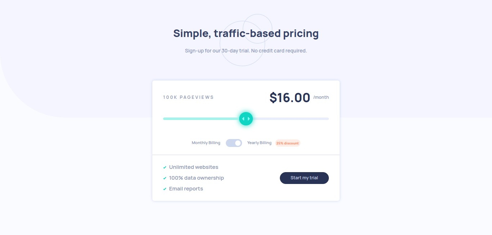

# Frontend Mentor - Interactive pricing component solution

This is a solution to the [Interactive pricing component challenge on Frontend Mentor](https://www.frontendmentor.io/challenges/interactive-pricing-component-t0m8PIyY8). Frontend Mentor challenges help you improve your coding skills by building realistic projects.

## Table of contents

- [Overview](#overview)
  - [The challenge](#the-challenge)
  - [Screenshot](#screenshot)
  - [Links](#links)
- [My process](#my-process)
  - [Built with](#built-with)
- [Author](#author)

## Overview

### The challenge

Users should be able to:

- View the optimal layout for the app depending on their device's screen size
- See hover states for all interactive elements on the page
- Use the slider and toggle to see prices for different page view numbers

### Screenshot

### Links

- Solution URL: (https://www.frontendmentor.io/solutions/responsive-and-interactive-pricing-component-card-BkSBqGcH9)
- Live Site URL: (https://abdallarahmah.github.io/Interactive-pricing-component/)

## My process

### Built with

- Semantic HTML5 markup
- CSS
- Flexbox

## Author

- linkedIn - [Abdalla-Rahmah](https://www.linkedin.com/in/abdalla-rahmah/)
- Frontend Mentor - [@AbdallaRahmah](https://www.frontendmentor.io/profile/AbdallaRahmah)
- Twitter - [@Abdalla_Rahmah](https://twitter.com/abdalla_Rahmah)
